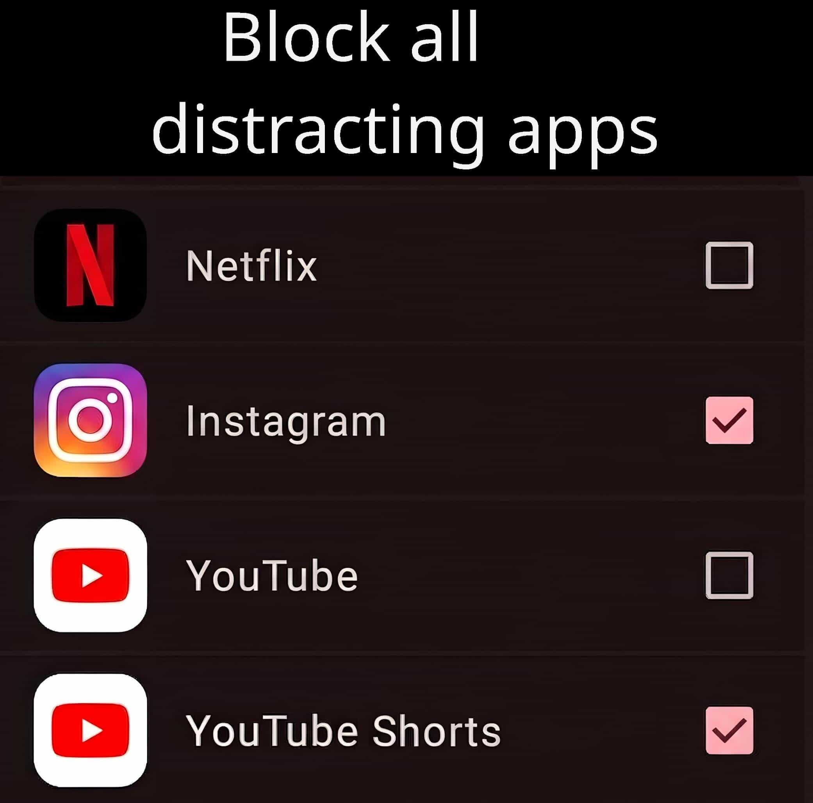
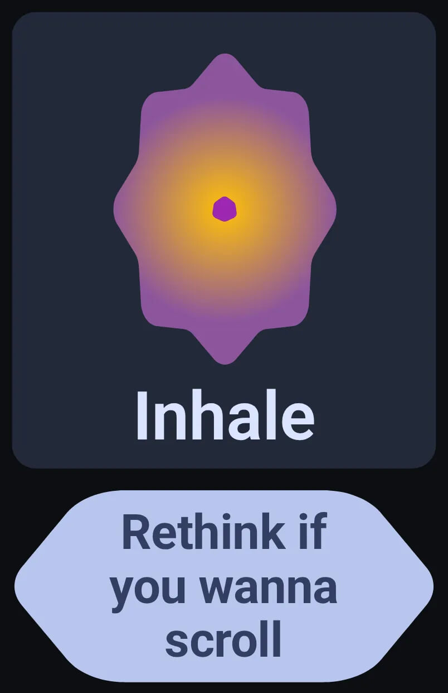
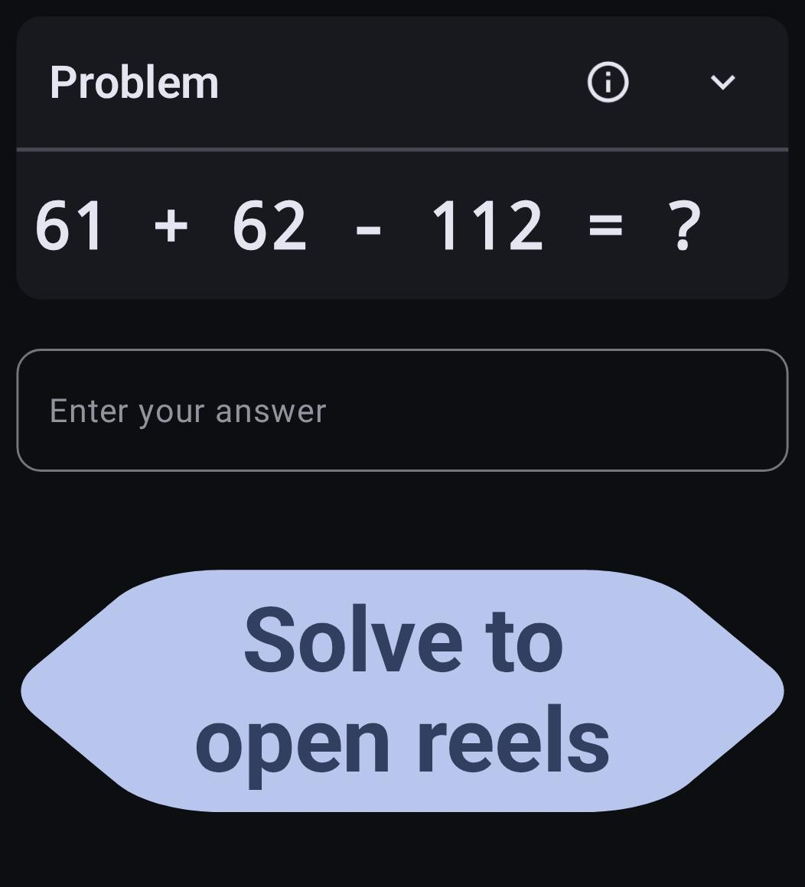

#  Zenwell

**Zenwell** is a privacy-first Android utility designed to help break the cycle of mindless scrolling. Select which apps you want to block(Eg: Instagram, Youtube Shorts) and Zenwell would not allow you open the app, unless you solve some hard math problems or practice breathing.

    
    
    

[**Download Latest APK**](../../releases)

---

## 🚀 Key Features

* **Customizable Schedules:** Select specific apps to block and set active windows (e.g., 9:00 AM – 5:00 PM) and specific weekdays.
* **Dynamic Unlock Methods:** Choose your level of friction to regain focus:
    * **Strict Block:** No entry allowed during restricted hours.
    * **Timer:** Wait for a set countdown before the app opens.
    * **Breathing Timer:** A guided pause to calm the "scroll reflex."
    * **Math Problems:** Solve math equations or multiplication tables.
    * **Intentional Typing:** Type a custom message to proceed.
* **Pomodoro Mode:** Integrated focus sessions to balance work and rest.
* **Privacy First:** **No Internet permission.** Your data stays on your device. Only Accessibility Service is required to function.

## 🛠 Bug Reporting

This project is in active development and multiple bugs are expected. Please report any issues you encounter or features you need in the [Issues tab](../../issues).
