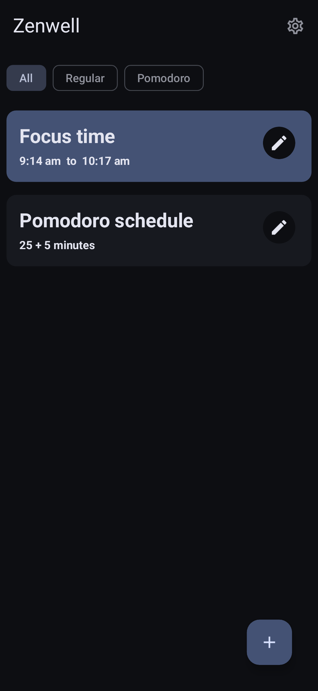
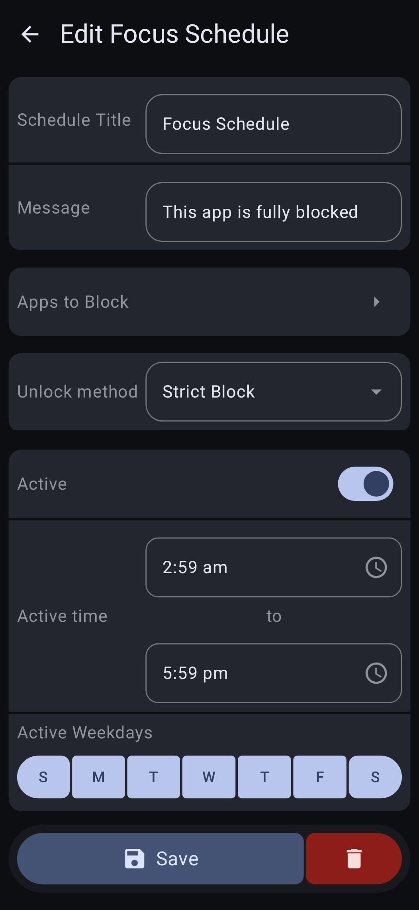
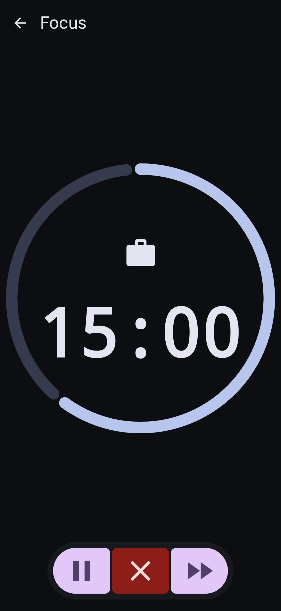
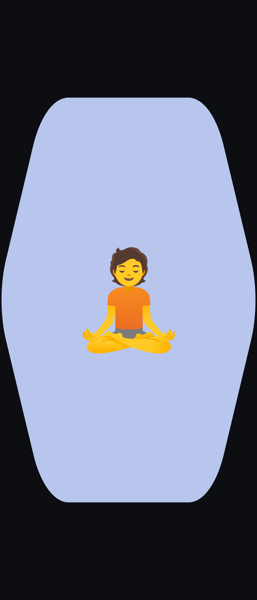
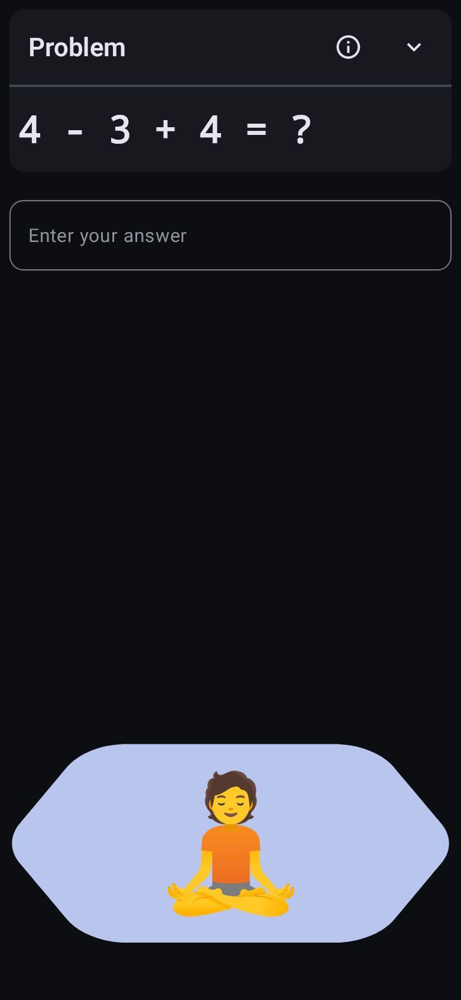
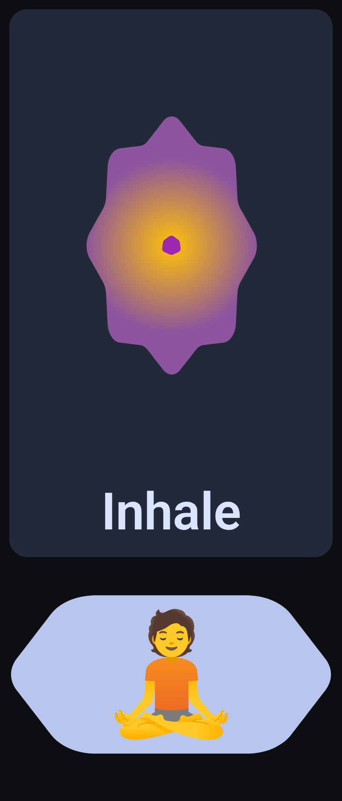

#  Zenwell

**Zenwell** is a privacy-first Android utility designed to help break the cycle of mindless scrolling. By placing a deliberate friction barrier over distracting apps, Zenwell forces a moment of mindfulness, encouraging you to step away and reclaim your time.

[**Download Latest APK**](../../releases)

---

## 🚀 Key Features

* **Customizable Schedules:** Select specific apps to block and set active windows (e.g., 9:00 AM – 5:00 PM) and specific weekdays.
* **Dynamic Unlock Methods:** Choose your level of friction to regain focus:
    * **Strict Block:** No entry allowed during restricted hours.
    * **Timer:** Wait for a set countdown before the app opens.
    * **Breathing Timer:** A guided pause to calm the "scroll reflex."
    * **Math Problems:** Solve math equations or multiplication tables.
    * **Intentional Typing:** Type a custom message to proceed.
* **Pomodoro Mode:** Integrated focus sessions to balance work and rest.
* **Privacy First:** **No Internet permission.** Your data stays on your device. Only Accessibility Service is required to function.

## 🛠 Bug Reporting

> [!WARNING]
> **PiP Mode Limitation**
> Zenwell does not currently support apps in Picture-in-Picture mode. You must **disable PiP** in the settings of the app you are trying to block. Failure to do so may cause the overlay window to appear globally over all other apps.

> [!IMPORTANT]
> **Navigating the Overlay**
> When the overlay is active, the **Back gesture/button will not work**. To exit the overlay and return to your home screen, you must use your **Home gesture** or the **Recents key**.

This project is in active development and multiple bugs are expected. Please report any issues you encounter or features you need in the [Issues tab](../../issues).

## Screenshots

    
    
    
    
    
    

